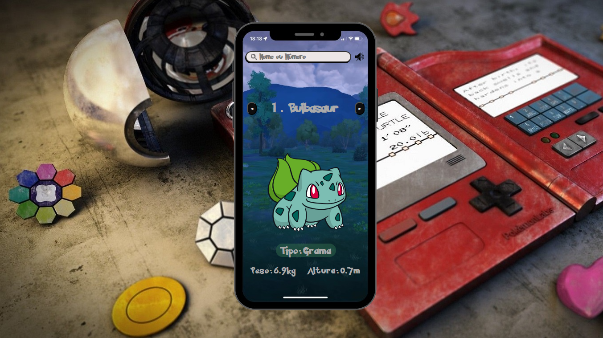

# APPDEX



## Funcionalidades

- Busca de Pokémon.
- Exibição de dados (altura, peso, tipo) e sua imagem.

## Tecnologias

Este projeto foi desenvolvido utilizando as seguintes tecnologias:

- **HTML**
- **CSS**
- **JavaScript**
- **PokeAPI**: Fonte de dados sobre Pokémon.

## Instalação

1. Clone o repositório:
   ```bash
   git clone https://github.com/V1vianes/Appdex.git

2. Abra o diretório
   ```bash
   cd POKEDEX

3. Abra o arquivo index.html no navegador.

