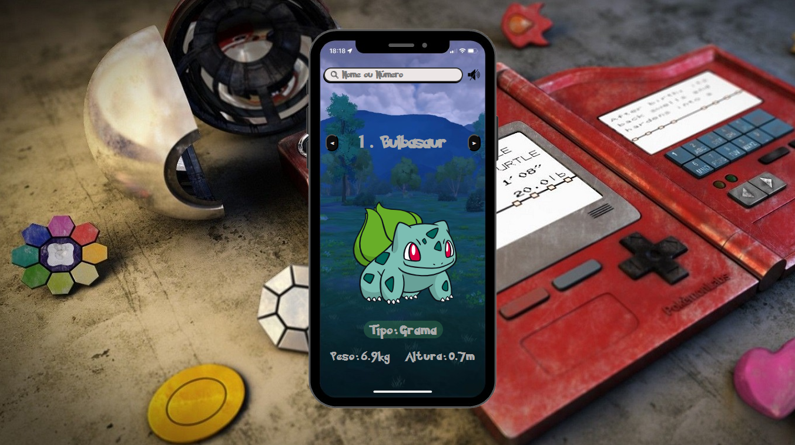

# APPDEX
Pagina web de um "app" pokédex.

## Funcionalidades

- Busca de Pokémon.
- Exibição de dados (altura, peso, tipo) e sua imagem.
- Som de fundo.

## Tecnologias

Este projeto foi desenvolvido utilizando as seguintes tecnologias:

- **HTML**
- **CSS**
- **JavaScript**
- **PokeAPI**: Fonte de dados sobre Pokémon.

## Projeto

- [Acesse o projeto finalizado, online](https://v1vianes.github.io/Appdex/)

